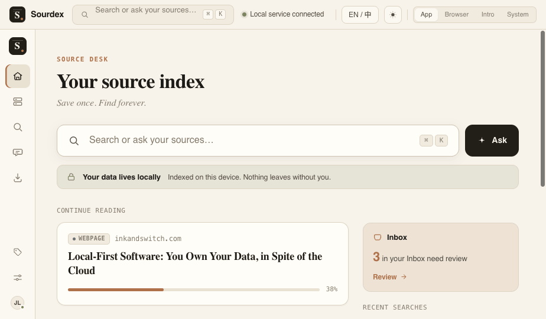
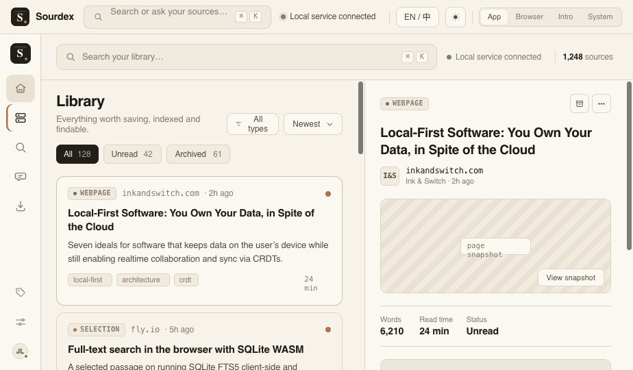
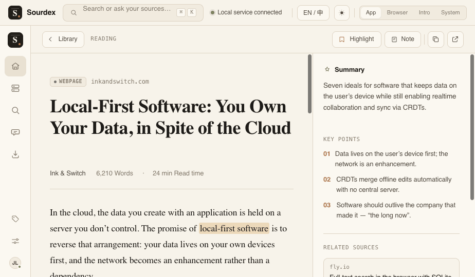
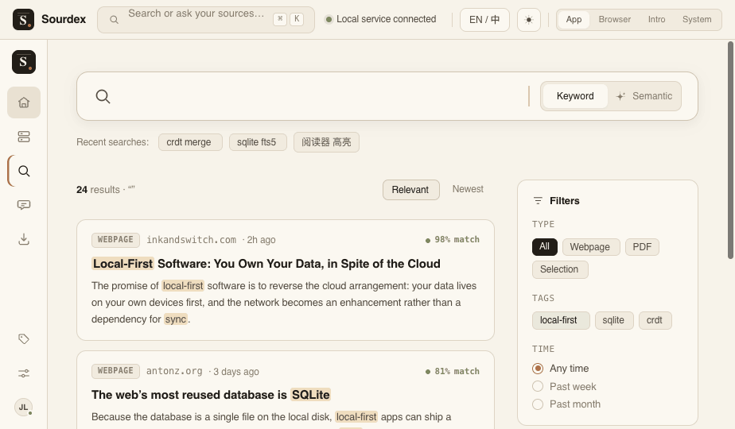
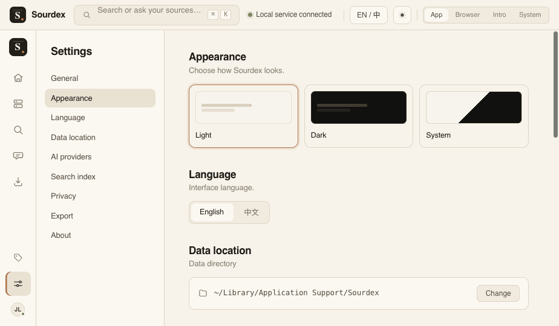
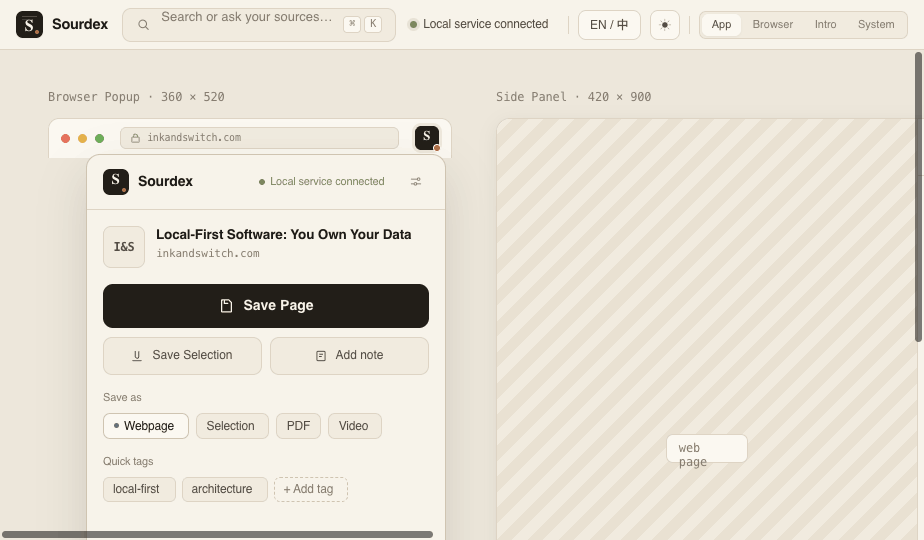

# Sourdex

> Local-first index for everything you save on the web. **Save once. Find forever.**

Sourdex 是一个**本地优先的全网资料索引库**。通过浏览器插件一键保存网页与选中文本，Sourdex 自动提取正文、生成 Markdown、保存来源、建立本地全文索引，并可导出到 Obsidian。它不是普通收藏夹，也不是普通 AI 知识库——核心是让保存过的资料**可搜索、可引用、可复用**，且本地优先、不锁定平台。

数据默认完全保存在你自己的设备上，**默认不上传任何资料内容**。

## 截图

> 以下为设计稿预览（`design/screenshots/`，浅色主题；深色主题见 `12`–`17`）。

| Source Desk | Library | Reader |
| --- | --- | --- |
|  |  |  |

| Search | Settings | Extension |
| --- | --- | --- |
|  |  |  |

## 核心功能（v0.1 MVP）

- 浏览器插件一键保存网页 / 选中文本（Chrome / Edge，Manifest V3）
- 自动正文提取 + HTML→Markdown + 原始快照
- 本地 SQLite 存储（数据完全在本地，数据目录可配置 / 可迁移）
- 全文搜索（SQLite FTS5，支持中英文）
- 阅读器 + Inbox / Library
- Markdown / Obsidian 导出

后续版本（v0.2+）：AI 摘要、自动标签、语义检索、可溯源问答（Ask）、高亮备注等。详见 [ROADMAP.md](ROADMAP.md)。

## 技术栈

TypeScript monorepo（pnpm + Turborepo）。前端 React + Vite + Tailwind + shadcn/ui；插件 WXT + MV3；本地服务 Node + Fastify + Zod + Drizzle + SQLite(FTS5)。详见 [docs/04_TECH_STACK.md](docs/04_TECH_STACK.md)。

## 安装

v0.1 为开发者预览版，从源码运行。要求：**Node ≥ 22、pnpm 10.x**（见 `.nvmrc` 与 `package.json` 的 `packageManager`）。

```bash
git clone <repo-url> Sourdex
cd Sourdex
pnpm install
pnpm build
```

## 本地运行

Sourdex 由三部分组成：**本地服务**（local service）、**Web UI**、**浏览器插件**。

### 1. 启动本地服务

```bash
pnpm --filter @sourdex/server start
```

服务默认监听 `http://127.0.0.1:8787`（仅本地回环，不对外网开放）。首次启动会在数据目录生成访问 token；数据目录默认：

- macOS：`~/Library/Application Support/Sourdex`
- Windows：`%APPDATA%\Sourdex`
- Linux：`~/.local/share/sourdex`

可用环境变量覆盖：`SOURDEX_DATA_DIR`、`SOURDEX_PORT`、`SOURDEX_HOST`（默认 `127.0.0.1`，请勿改为 `0.0.0.0`）。

### 2. 启动 Web UI

```bash
pnpm --filter @sourdex/web dev
```

Web UI 通过 token 访问本地服务。开发期可将配对得到的 token 注入：

```bash
VITE_SOURDEX_API_TOKEN=<token> pnpm --filter @sourdex/web dev
```

## 浏览器插件安装

```bash
pnpm --filter @sourdex/extension zip   # 产出 .output/sourdexextension-*-chrome.zip
```

在 Chrome / Edge 打开 `chrome://extensions` → 开启「开发者模式」→「加载已解压的扩展程序」选择 `apps/extension/.output/chrome-mv3/`（或解压上面的 zip）。

**首次连接配对**：在插件中发起配对 → 本地服务控制台会打印一个 6 位配对码 → 在插件中输入该码，即可换取访问 token（配对码仅在服务端控制台显示、5 分钟内有效，不经网络返回，本地恶意页面无法窃取）。

## 仓库结构

```text
apps/        extension | web | server
packages/    core | db | extractor | search | exporter
docs/        PRD 与开发文档体系（01~14）
design/      UI 设计稿（所有界面以此为视觉准则）
tests/       e2e
```

## 隐私

- **默认本地存储，默认不上传任何资料内容。** 详见 [docs/PRIVACY.md](docs/PRIVACY.md)。
- 本地服务默认仅监听 `127.0.0.1`；插件访问需 token，首次连接需用户确认。
- AI 功能为 v0.2，默认关闭；不配置 AI 时，保存 / 阅读 / 全文搜索 / 导出均正常工作。
- 安全问题报告见 [SECURITY.md](SECURITY.md)。

## Roadmap

见 [ROADMAP.md](ROADMAP.md)。简述：v0.1 闭环（保存→提取→索引→搜索→阅读→导出）→ v0.2 AI（摘要 / 标签 / 语义检索 / Ask）→ v0.3+ 桌面端等。

## Contributing

欢迎贡献。请先阅读 [CONTRIBUTING.md](CONTRIBUTING.md) 与 [docs/DEVELOPMENT.md](docs/DEVELOPMENT.md)，并遵守 [CODE_OF_CONDUCT.md](CODE_OF_CONDUCT.md)。本仓库采用文档驱动流程，开发约定见 [CLAUDE.md](CLAUDE.md)、[docs/03_ARCHITECTURE.md](docs/03_ARCHITECTURE.md) 与 `.claude/rules/`；所有 UI 必须严格按 `design/` 设计稿实现。

## License

[Apache-2.0](LICENSE)。

> PRD §20.1 给出 AGPL-3.0 / Apache-2.0 两个候选；本项目最终采用 **Apache-2.0**（宽松许可、含专利授权，便于传播与第三方集成）。
